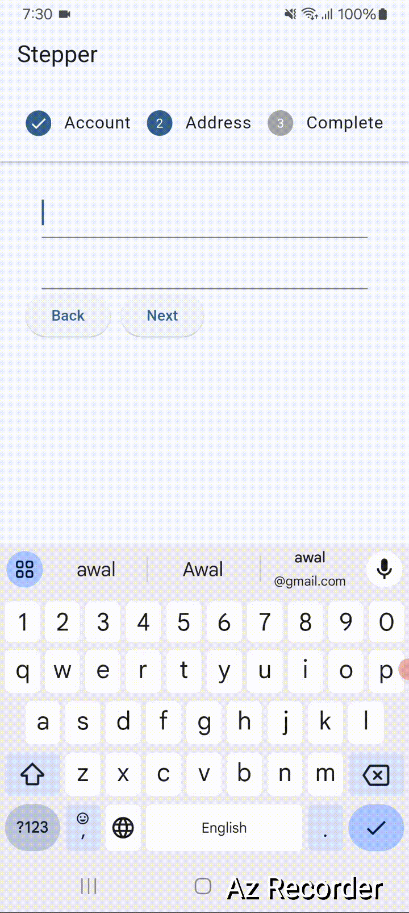

# Stepper Widget | The Right Way | Multi-Step Forms Flutter Dart Project Stepper Form

## A Flutter project implementing a horizontal stepper form UI for a multi-step form submission experience.

## Features

This project provides a clean and reusable horizontal stepper component for form inputs, perfect for applications needing a guided, multi-step form process. This codebase is only for the UI, and does not include backend integration. Features include:

- Step-by-step process completion.
- Summary display at the end of the form.
- Tick mark on each step completions.


<a></a>


## File stracture

    ├── lib
    │   ├── main.dart
    │   ├── stepper.dart
    │   ├── button.dart

## Run Locally

Clone the project

```bash
  git clone https://github.com/abdulawalarif/stepper_for_ecommerce.git
```

Go to the project directory

```bash
  cd stepper_for_ecommerce
```

Install dependencies

```bash
  flutter pub get
```

Connect a physical device or start a virtual device on your machine

```bash
  flutter run
```

## How to tweak this project for your own uses

This horizontal stepper can serve as a foundation for multi-step forms in various applications. Customize each step’s fields, validation, and submission logic according to your requirements. You can also switch to a vertical stepper layout by modifying `StepperType.horizontal` to `StepperType.vertical`.

## Reporting Bugs or Requesting Features?

If you found an issue or would like to submit an improvement to this project,
please submit an issue using the issues tab above. If you would like to submit a PR with a fix, reference the issue you created!

## Known Issues and Future Work

- Form validation for each step.
- Animations between steps.

## Author
- [@abdulawalarif](https://github.com/abdulawalarif)

## License
The MIT License (MIT). Please view the [License](LICENSE) File for more information.
